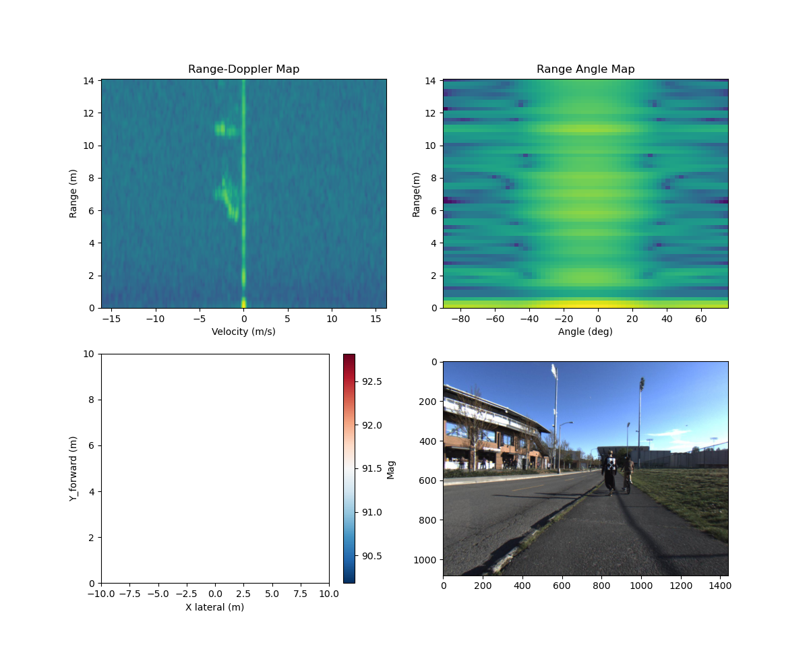

# Radar Point Cloud Generation from Raw ADC Data

Turning raw FMCW radar ADC samples into a clean, labeled 3D point cloud — no black-box toolbox, just signal processing built from scratch in Python.


*Range-Doppler map, Range-Angle map, and the resulting point cloud overlaid with the camera frame for the same instant.*

---

## Why this exists

Most "radar perception" tutorials start from a vendor's pre-built point cloud and skip the interesting part. This project starts from the **raw ADC cube** — the actual voltage samples coming off an AWR1843 automotive radar — and walks all the way to a usable point cloud:

```
raw ADC samples  ->  TDM-MIMO demux  ->  2D FFT (Range-Doppler)
                                      ->  2D FFT (Range-Angle)
                  ->  CA-CFAR detection  ->  angle-of-arrival estimation
                  ->  3D point cloud (x, y, velocity, magnitude)
```

## How it works

**1. Reading raw data** (`read_data.py`)
The radar captures a 4D ADC cube per frame. Since the AWR1843 uses TDM-MIMO (4 RX x 2 TX), the receive antennas are demultiplexed into 8 virtual antenna channels before any processing happens.

**2. Building Range-Doppler & Range-Angle maps** (`compute_fft.py`)
Two windowed FFT chains are computed:
- **Range-Doppler Map (RDM):** FFT across fast-time (range) and slow-time (chirps/velocity), with a Blackman window on both axes to suppress sidelobe leakage.
- **Range-Angle Map (RAM):** FFT across fast-time and the virtual antenna array (a Hann window keeps the angle estimate stable), giving angular resolution from the antenna phase differences.

**3. Detecting real targets** (`pointcloud_creation.py`)
A **2D Cell-Averaging CFAR (CA-CFAR)** detector slides over the Range-Doppler map, comparing each cell against the average noise level in its surrounding training cells (with a guard band to avoid leaking target energy into the noise estimate). This adaptively sets the detection threshold instead of using one fixed number, so the detector holds up across different noise floors and ranges. A static-clutter filter also throws out anything sitting at zero Doppler (parked cars, guardrails, the road itself).

**4. From detections to points**
For every CFAR detection, the angle is estimated from the Range-Angle FFT (taking the angle bin with peak energy), and the (range, Doppler, angle) triplet is converted into Cartesian `(x, y)`, radial velocity, and signal magnitude — i.e. a single point in the point cloud.

**5. Visualizing**
`visualize_data.py` renders all four views side-by-side: the Range-Doppler map, the Range-Angle map, the generated point cloud, and the corresponding camera image, so you can sanity-check the radar output against ground truth visually.

## Hardware / dataset assumptions

Tuned for the **AWR1843** automotive radar configuration used in RADIal-style raw ADC datasets:

| Parameter | Value |
|---|---|
| Carrier frequency | 77 GHz |
| Bandwidth | 0.67 GHz |
| Chirp time | 60 us |
| Samples / chirp | 128 |
| Chirps / frame | 255 |
| RX / TX antennas | 4 / 2 (8 virtual channels) |

These give roughly **22 cm range resolution** and **~0.13 m/s velocity resolution**, printed automatically when you run the pipeline.

## Project structure

```
Radar-Perception/
|-- read_data.py            # loads .mat ADC frames, TDM-MIMO demux
|-- compute_fft.py          # Range-Doppler & Range-Angle FFT processing
|-- pointcloud_creation.py  # CFAR detection + angle estimation + point cloud, entry point
|-- visualize_data.py       # 4-panel visualization (RDM, RAM, point cloud, camera)
`-- helping_functions/
    `-- 3d_iou.py             # standalone 3D IoU utility for bounding-box overlap checks
```

## Getting started

```bash
git clone https://github.com/dhananjaybhole4/Radar-Perception.git
cd Radar-Perception
pip install numpy scipy matplotlib pillow
```

Place your dataset (radar `.mat` frames + matching camera `.jpg` frames) in an `Automotive/` folder at the repo root, then run:

```bash
python pointcloud_creation.py
```

This picks a random frame, runs the full pipeline, prints the radar's range/velocity resolution and the number of CFAR detections, and pops up the 4-panel visualization.

## What I'd add next

- Tracking across frames (Kalman filter on the point cloud)
- Feeding the generated point clouds directly into a classifier (see [PointNet-Implementation](https://github.com/dhananjaybhole4/PointNet-Implementation))
- Swapping CA-CFAR for OS-CFAR to better handle multi-target / clutter-heavy scenes

## License

See [LICENSE](LICENSE).